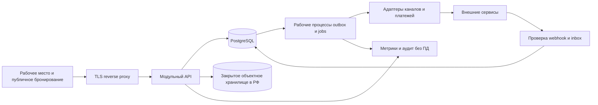

# Архитектура «Кей Календаря»

Статус: проектирование, 24.09.2026. Документы описывают будущую реализацию; приложение, интеграции и инфраструктура не реализованы. Функции RealtyCalendar подтверждаются только реестром исследования. Все решения ниже являются предложениями для нашего продукта.

Порядок чтения: [решения](decisions.md), [модель](data-model.md), [цена и деньги](pricing-ledger.md), [права](access-control.md), [контракты HTTP](api-contracts.md), [OpenAPI](openapi.json), [события и задания](events-jobs.md), [эксплуатация](operations.md), [перенос](../data/migration-spec.md).

## Состав системы

## Рекомендуемый стек

| Слой | Решение | Причина и граница |
|---|---|---|
| Интерфейс | React + TypeScript, сборка Vite, маршрутизация и query cache | Внутреннее рабочее место; виртуализация сетки и единая библиотека компонентов. Версии фиксировать в начале реализации после проверки поддержки. |
| Сервер | Node.js 24 LTS, TypeScript, Fastify; REST /api/v1 | Один язык, явные JSON Schema, сравнительно малая инфраструктура. SSR нужен только публичным страницам; отдельное решение не должно менять доменную модель. |
| Данные | PostgreSQL 18, SQL-миграции с review | Транзакционная бронь, RLS, составные FK, диапазоны дат, финансовая проводка. ORM допустим как query builder; ограничения базы обязательны. |
| Очередь | PostgreSQL job/outbox с lease и SKIP LOCKED | Нет отдельной точки потери сообщений. При доказанной нагрузке добавить транспорт, сохранив outbox источником доставки. |
| Файлы | S3-совместимое хранилище и ключи в РФ | Экспорты, документы и снимки импорта с TTL, без общедоступных bucket. |
| Размещение | Linux, контейнеры, reverse proxy, отдельные web/api/worker | Сначала отдельное окружение; текущая ВМ с SkySend не является готовой промышленной площадкой. В этой работе никакие службы на ней не изменяются. |
| Наблюдаемость | OpenTelemetry, Prometheus-совместимые метрики, Grafana, структурные логи | Идентификатор запроса проходит до job и канала; ПД и тела внешних запросов в общий лог не пишутся. |
| Проверки | Unit/domain, PostgreSQL integration, контрактные, browser E2E | Критичны конкурирующие продажи, права, деньги, порядок событий и восстановление. |

Node.js 24 имеет статус LTS на дату проверки: [официальный цикл](https://nodejs.org/en/about/previous-releases). PostgreSQL поддерживает [политики доступа к строкам](https://www.postgresql.org/docs/18/ddl-rowsecurity.html), [ограничения диапазонов](https://www.postgresql.org/docs/18/rangetypes.html) и [восстановление на момент времени](https://www.postgresql.org/docs/18/continuous-archiving.html). Это свойства технологий, а не доказательство корректности будущего приложения.

## Границы модулей

Identity → Organization → Inventory → Availability/Reservations → Guests/Rates → Ledger/Payments → Reports. Integrations переводят внешние события в команды соответствующих модулей. Billing управляет правами использования SaaS, но не меняет статус клиентского платежа по брони. Notifications получают события после фиксации транзакции. Support работает через отдельный административный контур.

Модуль не пишет в таблицы соседнего модуля напрямую. Для атомарного изменения брони, занятости, начислений, audit и outbox применяется одна транзакция и доменный сервис. Выделение микросервисов отложено до измеренного ограничения; распределённая транзакция для обычной брони не нужна.

## Производительность и вместимость

Проектная нагрузка для проверки, не данные действующего бизнеса: 100 организаций, 1 000 продаваемых единиц у крупнейшей организации, 2 млн броней всего, 50 одновременных сотрудников, 20 команд бронирования/сек с кратким пиком 100/сек. Начальное окно календаря 42 дня × 50 строк, максимум ответа 200 строк × 93 дня; следующие строки cursor pagination. Развёрнутая сетка 1 000 × 365 на клиент не загружается.

Цели staging под этой нагрузкой: p95 чтения календаря ≤ 800 мс, p95 записи брони ≤ 700 мс без времени внешнего сервиса, p95 первого рабочего экрана ≤ 2,5 сек на обычном ноутбуке при 20 Мбит/сек. Пользовательское подтверждение локальной брони не ждёт всех каналов; рядом виден статус доставки. Критичное предупреждение формируется при задержке синхронизации > 5 минут, но реальная частота обмена ограничена каждым договором/API.

Целевые SLO пилота: 99,5% доступности за месяц; после пилота 99,9% при двух узлах и проверенном переключении. Это внутренние цели, не обещание в договоре. Метрика учитывает ошибки собственного API; состояние внешних каналов показывается отдельно. Redis не нужен для целостности; при его добавлении его потеря не может продавать занятый объект.
