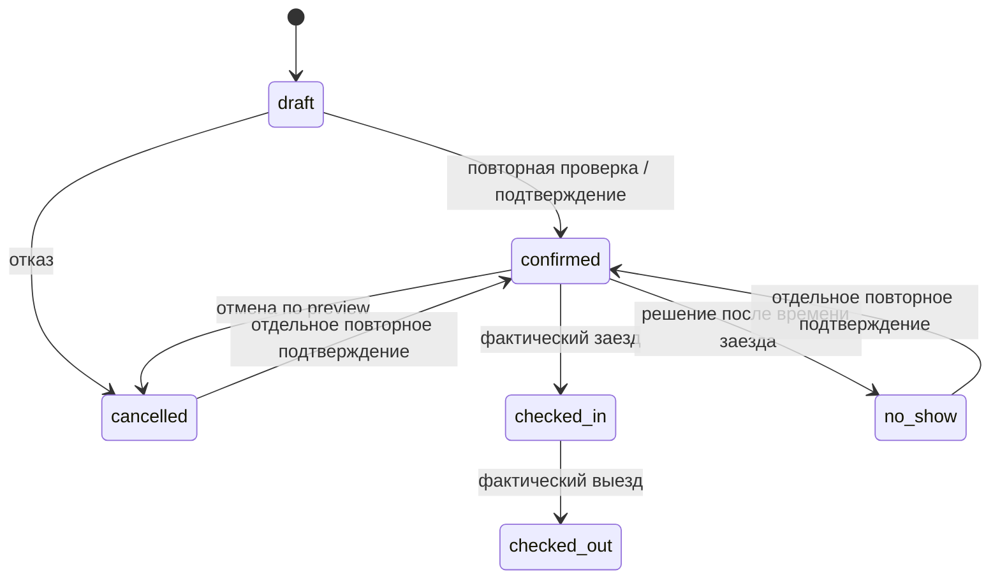

# Функциональная спецификация

Версия 1.0, 24.09.2026. Точный реестр действий/входов/правил/ошибок/приемки: [reference.json](reference.json) и [saas.json](saas.json). Этот документ связывает требования в согласованную систему. Числа примеров синтетические.

## Словарь

| Термин | Однозначное значение |
|---|---|
| Организация | Изолированный tenant, владелец бизнес-данных |
| Объект, Property | Физическое размещение/адрес и общие параметры |
| Категория, UnitCategory | Группа одинаковых номеров, без собственной дополнительной квоты |
| Единица, Unit | Атомарный продаваемый ресурс; отдельная квартира имеет минимум одну единицу |
| Бронь, Reservation | Коммерческий жизненный цикл и гость; может иметь несколько Stay при переселении |
| Stay | Проживание на конкретной единице/категории в непрерывном диапазоне дат |
| Заявка, draft | Предварительная договоренность без удержания доступности |
| Quote | Версионированный расчет стоимости/условий с истечением; место не резервирует |
| Hold | Короткое удержание доступности, по умолчанию 15 минут |
| Allocation | Факт занятости атомарной единицы: бронь, блок или hold |
| Block | Причинная техническая/личная блокировка без фиктивного гостя/выручки |
| Origin channel | Источник внешнего события и владелец внешнего ID |
| Attribution source | Аналитическая метка привлечения; изменение не переподключает канал |
| Charge | Начисление к оплате, включая услуги/штрафы/скидки и credit notes |
| Payment / capture | Подтвержденное поступление, отличное от ссылки/ожидания |
| Deposit | Отдельный залог: банковская авторизация либо полученные возвратные средства |
| Revenue | Заработанная выручка по оказанным ночам/услугам, отличная от поступившего аванса |
| Archive | Скрытие записи из рабочего представления с сохранением истории |
| Incident | Неустраненный конфликт фактов/размещения/обмена, который требует решения |

## Общие правила дат

Проживание задается локальными календарными датами `[from,to)` в IANA timezone объекта. Последняя дата — дата выезда и не оплаченная ночь. 10–12 сентября — две ночи; следующая бронь с 12 сентября допустима при отсутствии буфера. Количество ночей считают разностью дат, не миллисекунд/24 часа. Технические события, авторство и webhook timestamps хранятся UTC.

Время заезда/выезда — отдельные поля. Ранний заезд не создает автоматически дополнительную ночь: проверяются готовность/пересечение и политика услуги. Неизвестное время показано как неизвестное; оно не превращается в 00:00. Плановое и фактическое время различаются.

Фильтр периода всегда сообщает тип даты: создание, заезд, выезд, проживание или оплата. Условие report-date использует явно указанную timezone. В миграции неугадываемая timezone входит в очередь сверки. Архивный объект участвует в историческом отчете, когда его даты и scope выбраны.

## Общие правила денег и цены

Суммы хранятся целым minor units, API передает int64 строкой вместе с currency. Проценты — basis points. Округление и разнесение остатка определены в [pricing-ledger.md](../architecture/pricing-ledger.md). Итог равен сумме видимых округленных строк.

Правила KC: выбрать дневной override, иначе сезон, иначе день недели, иначе базу; применить доплаты состава, скидку длительности, совместимый промокод, отдельно разрешенную ручную скидку. Наценка OTA имеет явную политику и зависит от capability канала. Комиссия каналу — отдельный расход. Этот порядок является проектом KC, а не выводом о внутреннем алгоритме RC.

Ограничения проверяются независимо от цены: stop-sell, CTA/CTD, срок, вместимость, тариф и права источника. CTA ограничивает начало, CTD окончание; отсутствие точной поддержки у канала видно до отправки. Quote содержит версии правил, срок, строки и источник значений. Изменение цены в справочнике не переписывает принятую бронь.

Четыре денежные величины: C — начислено; P — успешно зачтено платежей проживания минус успешные возвраты; B=C−P — остаток/переплата; R — заработанная выручка по оказанным ночам. При C=10000, оплате6000 и возврате1000 B=5000. Залог, pending payment и созданная ссылка не увеличивают P. Подтверждение будущей брони создает receivable/deferred revenue, заработанная выручка признается по ночам.

Нельзя суммировать разные валюты без утвержденной политики курса. По умолчанию показывать раздельные итоги. Исправление posted проводки выполняется сторно и новой записью. Момент возврата денег, момент изменения начисления и момент выдачи чека — разные факты.

## Бронь, архив и доступность

Канонический lifecycle согласован с [моделью данных](../architecture/data-model.md):

Каждый переход требует разрешения, актуальной версии и допустимого исходного состояния. Confirm создает allocations атомарно. draft сам их не создает. Буфер подготовки и block проверяются тем же механизмом. checked_out сохраняет историческую занятость; досрочный выезд меняет будущую часть после preview. checked_in не отменяется обычной кнопкой отмены; используется сценарий досрочного выезда/коррекции.

Архивирование является отдельным признаком видимости. Активную будущую бронь нельзя просто скрыть и считать освобожденной: сначала разрешенный preview отмены. Снятие архива возвращает запись в список, но не переподтверждает отмененную бронь. Повторное подтверждение — отдельная проверка доступности и новая версия. Платежи, залоги и аудит архивом не удаляются. Это осознанное уточнение KC, не буквальное воспроизведение всех крайних случаев RC.

Изменение дат/единицы: сформировать preview, проверить новые Stay/quote/связанные задачи, заблокировать ресурсы в стабильном порядке, заменить весь набор allocations в одной транзакции. При конфликте старое размещение остается. Перетаскивание, если добавляется, использует этот же сценарий; альтернатива всегда форма.

Два локальных подтверждения одного ресурса не могут успешно пересечься. PostgreSQL constraint окончательно защищает запись. Проверка в UI дает подсказку, а не гарантию. Истекший hold освобождается под блокировкой в транзакции следующей продажи, поэтому запаздывание уборщика задач не создает вечную занятость.

## Номерной фонд

Категория продает общий тариф, а система ищет непрерывно свободную атомарную единицу. При необходимости бронь видна менеджеру как «Нужно назначить», но уже имеет provisional_unit_id и allocation. Подтверждение номера не списывает квоту повторно. Разные цены конкретных единиц не подменяют принятую категорийную цену.

Если сумма свободных номеров по дням положительна, но цельного размещения нет, новая прямая продажа не обещается. Предварительные назначения можно переставить только атомарно с проверкой всех интервалов. Согласованное переселение оформляется несколькими Stay. Уже подтвержденное внешнее бронирование без места сохраняется как incident и требует решения.

Уменьшение фонда/архив номера проверяет будущие Stay, provisional назначения, блоки и подключения. Удалить связанный номер незаметно нельзя. Поддержка категории по API и отдельного номера по iCal отражается в паспорте канала.

## Прямая бронь и платеж

| Шаг | Результат | Ошибка и продолжение |
|---|---|---|
| Поиск | Публичные доступные варианты, без чужих гостей | Пусто → изменить параметры; сбой карты → доступный список |
| Quote | Точная сумма/условия/срок | Недостаточно цены → не обещать возможность брони |
| Hold | Квота зарезервирована на TTL | 409 → предложить варианты; повтор с тем же ключом возвращает прежний hold |
| Checkout | Hosted URL выбранного провайдера | Нет подключения → показать недоступный способ |
| Callback/webhook | Durable факт в inbox, затем проверка/проводка | Redirect без проверенного события оставляет ожидание |
| Подтверждение | Бронь/суммы и сообщение по правилам | Поздняя оплата после истечения hold → incident/сверка, без второй продажи занятого номера |

При неясном результате внешней оплаты система сначала запрашивает состояние прежнего intent. Новый запрос с новым ключом не создается автоматически. Неуспешный платеж не означает, что банковское списание точно отсутствовало.

## Отмена, возврат и залог

Отмена начинается с preview принятой политики: аннулируемые начисления, штраф, новое C/P/B, доступная сумма возврата и состояние залога. Preview ничего не меняет. Commit требует его hash и If-Match; изменение возвращает 412 и новый расчет. Ручное исключение из политики требует отдельного права/причины.

Возврат проживания — новая операция, связанная с исходным платежом. Pending refund резервирует доступный остаток и предотвращает параллельный двойной возврат. В P учитывается только success. Чек имеет независимый автомат и может требовать отдельного повторного действия.

Для залога различаются:
- authorization: created → authorized → captured / released / expired / failed; до capture полученных денег нет;
- transfer/manual capture: awaiting → received → partially_returned / returned / partially_retained / settled.

Release авторизации не равен возврату перечисленных денег. Оплаченную сумму нельзя редактировать задним числом. Удержание требует причины, доказательств и финансового разрешения. Завершение уборки порождает задачу проверки залога, а не автоматический банковский возврат.

## Интеграции и принадлежность полей

Исходный канал/external_booking_id определяет внешний факт. Аналитический источник не меняет владение. Даты, стоимость и отмена OTA управляются только подтвержденным каналом способом. Если исходящий update отсутствует, UI ведет в источник и честно сообщает границу.

Входящее событие проверяется и сохраняется до подтверждения получения; обработка идемпотентна. Сначала исходный факт, затем доменная команда, аудит и outbox. Конфликт не удаляет сообщение. Поздние/повторные события сравниваются по версии/времени конкретного провайдера, а неоднозначность идет на сверку.

Исходящая доставка имеет queued/sending/acknowledged/retry/error/unknown outcome. Зеленый статус невозможен лишь на основании локального save. iCal помечается как обмен календарями, имеет свою задержку и не считается API цен/платежей. Полные паспорта и договорные gates определяют допустимые поля и операции.

## Гость, документы и сообщения

Поиск гостя ограничен tenant и разрешенными связанными бронями. Совпавшие имя/телефон дают кандидатов, не автоматическое слияние. Источник OTA может прислать маску контакта; ее нельзя выдать за проверенный адрес доставки.

Публичная витрина не раскрывает internal notes, источник чужой брони, финансовый остаток или код доступа. Портал гостя ограничен одной бронью, сроком и отзывом токена. Выдача инструкций/кода повторно проверяет оплату, документы, время и другие настроенные условия. Файл-квитанция сам не доказывает поступление.

Документы собираются по установленной цели/основанию, проходят проверку и хранятся отдельно с журналом доступа. Подпись договора не считается юридически подтвержденной до закрытия соответствующего gate. Версия подписанного текста неизменяема.

Автосообщение привязано к event+booking+template version. При переносе перепланируются неотправленные задания, при отмене ненужные отправки снимаются. Перед фактической доставкой повторно проверяются долг, контакты, права/основание и условия кода. Сбой письма не откатывает успешную бронь. Неясный delivery outcome требует сверки, а не бесконечного повторения.

## Ежедневные операции и отчеты

Заезды/выезды показываются по локальному дню с неизвестным временем в отдельной группе. Исполнитель получает только свою задачу и нужные сведения. Уборка имеет назначение/срок/готовность/проблему/завершение; повторное событие выезда не создает дубликат. Поломка/закупка, показание прибора и начисление сотруднику сохраняются отдельными сущностями и историей.

Отчеты используют согласованные фильтры, версию методики и расшифровку. Occupancy=occupied unit-nights/available unit-nights; ADR=room revenue/occupied; RevPAR=room revenue/available. Нулевой знаменатель — прочерк с пояснением. Портфельный итог взвешен; среднее процентов, если нужно, отдельно подписано. При отсутствии ночной детализации миграции отчет показывает оценку и основание.

## SaaS и режим ограничения

Регистрация/вход/восстановление/приглашение работают с одноразовыми токенами и не раскрывают существование чужих аккаунтов. Последний owner сохраняется. Scope применяется до поиска, пагинации и агрегирования, а также к файлам/jobs/аудиту.

Trial, лимиты и grace являются параметрами версии плана. По окончании grace рабочее место read-only; экспорт и операции безопасности доступны. Входящие подтвержденные события и аварийное закрытие продаж продолжают обрабатываться, новые публичные продажи закрываются. Данные не удаляются автоматически из-за неоплаты. Точный контракт: ADR-011..014.

## Общие состояния интерфейса и приемка

| Состояние | Что видит пользователь | Доступное действие |
|---|---|---|
| Loading | Сохраненная геометрия, подпись загрузки | Отмена перехода, если безопасна |
| Empty | Причина: нет объектов/записей/совпадений | Создать при наличии права либо сбросить фильтр |
| Ready | Текущие данные и время свежести, если важно | Разрешенные действия |
| Read-only | Причина: роль/подписка/офлайн | Читать разрешенное; понятный путь восстановления |
| Validation error | Ошибка возле поля плюс итог | Исправить без потери формы |
| Conflict 409 | Собственные доступные конфликтующие даты/объекты | Выбрать альтернативу |
| Version 412 | Обновленная запись и безопасный diff | Пересмотреть и подтвердить заново |
| External unknown | Локальный результат и неопределенное внешнее состояние | Проверить состояние, без дублирующего эффекта |
| Partial delivery | По каждому каналу свой результат | Повтор только разрешенного сбоя |
| Access revoked | Данные очищены, причина без чужих деталей | Переключиться или войти заново |

Фокус после закрытия диалога возвращается в вызвавший элемент. Все действия доступны клавиатурой; выбор диапазона и drag имеют форму-альтернативу. Цвет никогда не единственный носитель статуса. На узком экране оперативный список и карточка сохраняют доступ к действию, а полная сетка имеет явную горизонтальную прокрутку.

Приемка выполняется по test_id реестра, [плану тестирования](../plan/testing.md) и [тестовым случаям](../plan/test-cases.json). Нужны основной сценарий, границы, запрет другой роли/tenant, повтор запроса, конкурентная запись и сбой после фиксации. Для обратимых изменений представления достаточно визуальной проверки и проверки доступности; финансовые и интеграционные инварианты проверяются на реальной БД и разрешенном sandbox.

Контракты ошибок и общей версии API находятся в [api-contracts.md](../architecture/api-contracts.md). При расхождении чисел TTL, ролей или имен enum согласовать документ до реализации; не создавать второе поведение в UI.
